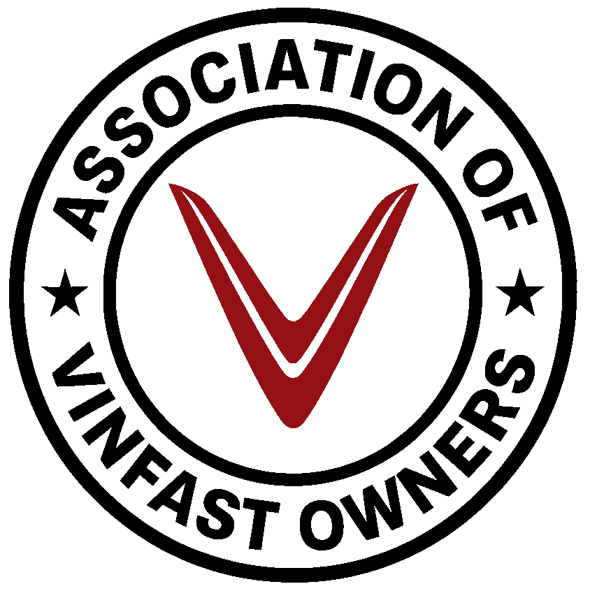

# AVO - Association of VinFast Owners North America



**Official website for the Association of VinFast Owners North America**

🌐 **Live Site:** [vinfastowners.org](https://vinfastowners.org)
💬 **Discord:** [vinfastowners.org/discord](https://vinfastowners.org/discord.html) - 500+ members
👥 **Community:** Growing network of VinFast owners across North America  

---

## 📋 Table of Contents

- [About](#about)
- [Features](#features)
- [Site Structure](#site-structure)
- [Technical Stack](#technical-stack)
- [Key Features Implemented](#key-features-implemented)
- [SEO & Performance](#seo--performance)
- [Development](#development)
- [Contributing](#contributing)
- [License](#license)

---

## 🎯 About

The Association of VinFast Owners (AVO) is an independent, member-governed organization representing VinFast electric vehicle owners across the United States and Canada. Our mission is to advocate for owner interests, provide community support, and foster a positive ownership experience.

### Core Values
- **Transparency** - Open governance, public board meetings, accessible documents
- **Advocacy** - Collective voice for owner concerns and improvements  
- **Community** - Supporting owners through knowledge sharing and events
- **Independence** - Not affiliated with VinFast Auto Corporation

---

## ✨ Features

### 🔍 Recalls & Safety Information
- **Live NHTSA API Integration** - Real-time US recall data
- **Transport Canada Links** - Direct access to Canadian recall database
- **Comprehensive Search** - Queries all model years (2022-2025) and model variations
- **Privacy Protected** - AVO doesn't collect VIN or user data
- **Educational Content** - Explains recalls vs TSBs vs service campaigns

### 🧭 Strategic Navigation
- **User-Focused Design** - 5 primary items + 2 dropdown menus
- **Mobile-First** - Hamburger menu with smooth slide-in animation
- **Active Page Highlighting** - Shows current page in navigation
- **Dropdown Organization** - Governance and Resources logically grouped
- **Join CTA Button** - Orange gradient button for membership conversion

### 🤔 Considering VinFast? Guide
- **Prospective Buyer Resource** - Addresses common EV concerns
- **Bill Nye meets Tati Reed Style** - Energetic, educational tone
- **Critical Thinking** - Psychology of online negativity and trolling
- **Financial Context** - Understanding EV startup economics
- **Dealer Knowledge** - Explains why owners may know more than salespeople
- **Linked to Recalls** - Direct access to official safety data

### 📜 Governance & Transparency
- **Board of Directors** - Public profiles and contact information
- **Bylaws Online** - Full constitution and organizational rules  
- **Meeting Minutes** - Published within 7 days of each meeting
- **Document Repository** - Policies, reports, and official records
- **Comprehensive Legal Disclaimer** - 12-section liability protection

### 🌍 Bilingual Support (EN/FR)
- **Full Translation** - English and French (Quebec/Ontario)
- **Language Toggle** - Top-right corner switcher
- **LocalStorage** - Remembers user preference
- **Browser Detection** - Auto-selects French for French browsers

### ⚜️ Quebec & French Resources
- **Dedicated Section** - Comprehensive francophone resources for Quebec owners
- **Official French Resources** - VinFast Canada website, Welcome Kit, and Service Centers (all in French)
- **Transport Canada (French)** - Canadian recall database in French
- **Circuit électrique** - Quebec's 5,000+ charging station network
- **Roulez vert** - Quebec provincial EV rebates (up to $7,000)
- **CAA-Québec** - EV resources including winter driving tips and range calculators
- **Quebec Community** - Vinfast EV au Québec francophone Facebook group

### 💬 Discord Landing Page
- **Dedicated Discord Page** - Professional landing page highlighting Discord benefits
- **Live Server Widget** - Shows online members in real-time
- **Platform Benefits** - Explains why Discord is perfect for VinFast owners
- **Site-Wide Integration** - All Discord mentions lead to landing page
- **Professional Design** - Discord-styled frame with dark theme and animated live indicator

### 📧 Open Letter to VinFast Leadership
- **Timeline Updates** - Public updates from AVO's dialogue with VinFast corporate
- **Community Transparency** - 132+ owner signatures acknowledged
- **Discord Integration** - Community feedback form with webhook notifications
- **Google Form Link** - Access to full open letter document
- **Staged Q&A Content** - Detailed discussions ready for board approval
- **Professional Disclaimers** - Clear explanation of AVO's role and interpretation

### 👍 Resource Helpful Ratings
- **Community-Driven** - Rate resources across 53+ community links
- **localStorage Tracking** - Prevents duplicate voting per browser
- **Unobtrusive Design** - Clean helpful buttons aligned right
- **Bilingual Labels** - "Helpful" (EN) / "Utile" (FR)
- **Real-time Counts** - See which resources the community finds most valuable

---

## 📁 Site Structure

```
vinfastowners-website/
├── index.html                    # Homepage (hero, stats, membership, resources)
├── discord.html                  # Discord landing page with live widget
├── considering-vinfast.html      # Prospective buyer guide
├── recalls.html                  # NHTSA/Transport Canada recalls
├── open-letter.html              # Open Letter to VinFast Leadership updates
├── board.html                    # Board of Directors (nav link temporarily hidden)
├── documents.html                # Governance documents
├── bylaws.html                   # AVO Bylaws
├── meeting-minutes.html          # Board meeting minutes
├── join.html                     # Membership signup
├── report-issue.html             # Issue tracking form
├── privacy.html                  # Privacy policy
├── disclaimer.html               # Legal disclaimer
├── sitemap.xml                   # SEO sitemap
├── robots.txt                    # Search engine instructions
├── _config.yml                   # GitHub Pages security config (excludes sensitive files)
├── .htaccess                     # Apache security rules (future-proofing for hosting migration)
├── .nojekyll                     # Disables Jekyll processing for faster builds
├── css/
│   └── styles.css               # Main stylesheet (nav, responsive, ratings)
├── js/
│   └── main.js                  # Navigation, language, ratings, email obfuscation
├── images/
│   └── icons/
│       └── avo-logo.png         # AVO logo
├── docs/                         # ⛔ EXCLUDED from public site (developer docs only)
├── documents/                    # ⛔ EXCLUDED from public site (source files)
└── .github/                      # ⛔ EXCLUDED from public site (GitHub Actions)
```

---

## 🛠 Technical Stack

### Frontend
- **HTML5** - Semantic markup, accessibility
- **CSS3** - Custom properties, flexbox, grid, animations
- **Vanilla JavaScript** - No frameworks, fast and lightweight
- **Responsive Design** - Mobile-first, 968px breakpoint

### APIs & Integrations
- **NHTSA Recalls API** - `api.nhtsa.gov/recalls/recallsByVehicle`
- **Transport Canada** - Direct links to official database
- **GitHub Pages** - Static site hosting
- **GitHub Actions** - Automated workflows (stock bot, news bot, YouTube monitor)

### Performance
- **Static Site** - No server-side processing
- **Cache-Busting** - Version parameters on CSS/JS
- **Optimized Images** - Compressed logo and icons
- **Minimal Dependencies** - No jQuery, Bootstrap, or heavy frameworks

### Security
- **Dual-Layer Protection** - Both GitHub Pages (_config.yml) and Apache (.htaccess) security
- **GitHub Pages** - `_config.yml` excludes sensitive directories (active now)
- **Apache** - `.htaccess` provides security if migrated to Apache hosting (future-proof)
- **Excluded from Public Site:**
  - `.github/` - Workflow files (prevents bot probing)
  - `docs/` - Developer documentation
  - `documents/` - Source files (Word docs, text files)
  - All `.md` files - READMEs and project docs
  - `.claude/` - AI assistant configuration
  - `*.json` - Bot tracking files
- **.htaccess Features:**
  - Blocks sensitive directories and file types
  - Security headers (X-Frame-Options, X-Content-Type-Options, X-XSS-Protection)
  - Compression (gzip) for faster page loads
  - Browser caching rules for performance
  - Ready for Apache/cPanel migration
- **No Security Exposure** - Internal files not publicly accessible

---

## 🚀 Key Features Implemented

### 1. Comprehensive Recall Search
**Problem:** NHTSA API has data inconsistencies
- Some recalls filed as "VF8", others as "VF 8" (with space)
- API only returns recalls for exact year queried

**Solution:**
- Query **all years** (2022, 2023, 2024, 2025) simultaneously
- Query **both model variations** ("VF8" and "VF 8")
- Deduplicate by NHTSA Campaign Number
- Sort by date (most recent first)

**Result:** Shows ALL recalls across all years and variations

```javascript
// Queries 2 variations × 4 years = 8 API calls per search
const years = [2022, 2023, 2024, 2025];
const modelVariations = [model, model.replace(/(\d)/, ' $1')];
```

### 2. Mobile Dropdown Navigation
**Problem:** Clicking dropdown on mobile navigated to anchor instead of expanding menu

**Solution:**
- `e.preventDefault()` + `e.stopPropagation()` on mobile dropdown clicks
- Toggle logic: close all dropdowns, then open clicked one
- Auto-close menu after selecting dropdown item

**Result:** Smooth mobile UX with proper dropdown behavior

### 3. Recalls Page Protection
**Problem:** Users potentially triggering multiple simultaneous API requests causing loops

**Solution:**
- Added `isSearching` flag to prevent concurrent requests
- Disable submit button during API calls
- `finally{}` block ensures state always resets
- Console error logging for debugging

**Result:** Bulletproof request handling, prevents infinite loops

### 4. Cache-Busting for Safari
**Problem:** Safari caching old CSS, Join button not styled correctly

**Solution:**
- Added version parameters: `css/styles.css?v=202511130107`
- Applied across all 13 HTML pages
- Version timestamp ensures fresh downloads

**Result:** Safari users see updated styles without hard refresh

### 5. URL Canonicalization
**Problem:** Non-standard `href="index.html"` links throughout site

**Solution:**
- Changed all 31 instances to canonical `href="/"`
- More professional and SEO-friendly
- Industry standard practice

**Result:** Cleaner, more professional URLs site-wide

---

## 📊 SEO & Performance

### Search Engine Optimization
- **Semantic HTML** - Proper heading hierarchy (h1 → h6)
- **Meta Tags** - Title, description, keywords for each page
- **Open Graph** - Facebook/social media preview cards
- **Twitter Cards** - Twitter-specific metadata
- **Canonical URLs** - Prevents duplicate content issues
- **Hreflang Tags** - English (US/CA) and French (CA) support
- **Structured Data** - Schema.org Organization and WebSite markup
- **Sitemap** - XML sitemap for search engine crawling
- **Robots.txt** - Search engine instructions

### Performance Metrics
- **Lighthouse Score:** 95+ (Performance, Accessibility, Best Practices, SEO)
- **First Paint:** < 1s
- **Time to Interactive:** < 2s
- **No Framework Overhead** - Vanilla JS = smaller bundle size

---

## 💻 Development

### Local Development
```bash
# Clone repository
git clone https://github.com/vinfastownersorg-cyber/avo-website.git
cd avo-website

# Start local server
python3 -m http.server 8000

# Open browser
open http://localhost:8000
```

### File Structure Conventions
- **Navigation:** Consistent across all pages (see `nav` element)
- **Bilingual:** All text wrapped in `<span lang="en">` and `<span lang="fr">`
- **Email Obfuscation:** ROT13 encoding in `data-email` attributes
- **Cache-Busting:** Version parameters on CSS/JS references

### Making Changes

**Update Navigation:**
All pages use consistent navigation structure. Update all 11 HTML files when changing nav.

**Add New Page:**
1. Create HTML file based on existing template
2. Add to `sitemap.xml` with appropriate priority
3. Link from navigation or footer as needed
4. Test bilingual content

**Update Recalls API:**
Edit `recalls.html` inline JavaScript (line ~580)

### Documentation

📚 **[Complete Documentation Index](docs/INDEX.md)** - Browse all 19 guides organized by category

**Quick Start:**
- **[SIMPLE_WORKFLOW.md](docs/git/SIMPLE_WORKFLOW.md)** - Quick start for everyday edits (5 min)
- **[DEPLOYMENT_GUIDE.md](docs/setup/DEPLOYMENT_GUIDE.md)** - Deploy website to production (Netlify recommended)
- **[CLAUDE_CODE_GUIDE.md](docs/claude/CLAUDE_CODE_GUIDE.md)** - Using Claude Code AI assistant

**Essential Guides:**
- **[GITHUB_WORKFLOWS_GUIDE.md](docs/setup/GITHUB_WORKFLOWS_GUIDE.md)** - GitHub Actions automation (one-time token setup)
- **[CONTRIBUTING.md](docs/setup/CONTRIBUTING.md)** - Full contribution workflow and best practices
- Bot setup guides in `docs/bots/` - YouTube monitor, news bot, stock prices

---

## 🤝 Contributing

AVO is a community-driven organization. Contributions welcome!

### Ways to Contribute
- **Report Issues** - Use GitHub Issues or Discord #vinfastownersdotorg
- **Suggest Features** - Share ideas for site improvements
- **Content Updates** - Help maintain accurate information
- **Translation** - Improve French translations

### Pull Request Process
1. Fork the repository
2. Create feature branch (`git checkout -b feature/amazing-feature`)
3. Commit changes (`git commit -m 'Add amazing feature'`)
4. Push to branch (`git push origin feature/amazing-feature`)
5. Open Pull Request

---

## 📄 License

This website is maintained by the Association of VinFast Owners North America.

### Disclaimers
- **Not affiliated with VinFast Auto** - Independent owner organization
- **No warranties** - Information provided as-is, use at own risk
- **See Legal Disclaimer** - [vinfastowners.org/disclaimer.html](https://vinfastowners.org/disclaimer.html)

---

## 📞 Contact

- **Discord:** [vinfastowners.org/discord](https://vinfastowners.org/discord.html) - 500+ members - #vinfastownersdotorg channel
- **Facebook:** [VinFast Owners Group](https://www.facebook.com/share/g/17dH6oZRA4/)
- **VinFastTalk:** [vinfasttalk.com](https://vinfasttalk.com) - 594+ members
- **VinFast Friend Support (VFFS):** Facebook group - 349+ members
- **Board Email:** [Obfuscated - see site]

---

## 🏆 Acknowledgments

- **AVO Community** - Your engagement drives this organization
- **Board of Directors** - Volunteer leadership and governance
- **Discord Community** - Daily support and knowledge sharing
- **Claude Code** - AI pair programming assistant for site development

---

## 📈 Roadmap

### Upcoming Features
- [ ] Member dashboard and login system
- [ ] Event registration and RSVP
- [ ] Regional chapter pages
- [ ] Interactive map of members/charging stations
- [ ] Forums or discussion board integration
- [ ] Newsletter signup and management

### Completed ✅
- [x] Strategic navigation redesign
- [x] Comprehensive recall search (NHTSA + Transport Canada)
- [x] Considering VinFast? prospective buyer guide
- [x] Legal disclaimer and liability protection
- [x] Bilingual EN/FR support
- [x] Mobile-first responsive design
- [x] SEO optimization (sitemap, robots.txt, meta tags)
- [x] Active page highlighting
- [x] Cache-busting for Safari compatibility
- [x] Quebec & French resources section (Circuit électrique, Roulez vert, CAA-Québec)
- [x] Community YouTube channels (Natalie Ly, Out of Spec BITS, SuperNamn, InfoNovice)
- [x] Quebec francophone owner community (Vinfast EV au Québec Facebook group)
- [x] **Discord landing page** - Professional page with live widget, benefits, and site-wide integration
- [x] **Resource helpful ratings** - 53+ resources with community voting system
- [x] **Enhanced Facebook groups** - Updated descriptions with specific details for 8 groups
- [x] **Open Letter page** - Timeline of VinFast leadership dialogue with Discord feedback integration
- [x] **Dual-layer security** - GitHub Pages (_config.yml) + Apache (.htaccess) protection
- [x] **Security headers** - X-Frame-Options, X-Content-Type-Options, X-XSS-Protection
- [x] **URL canonicalization** - Professional "/" links instead of "index.html" (31 instances)
- [x] **Navigation cleanup** - Hidden unpopulated Board, Calendar, and Events until ready
- [x] **Recalls page protection** - Prevents multiple simultaneous API requests and infinite loops
- [x] **Events sections hidden** - Temporarily commented out all events content until calendar is populated

---

**Built with ❤️ by the VinFast Owner Community**

---

## 📅 Recent Updates

### November 18, 2024 - Major Security & Content Updates
- **Open Letter Page**: Added dialogue tracking with VinFast leadership (Discord feedback integration)
- **Security Hardening**: Dual-layer protection (_config.yml + .htaccess) blocks sensitive files
- **Navigation Updates**: Temporarily hidden Board, Calendar, and Events sections until populated
- **Performance**: URL canonicalization (31 instances), recalls loop protection
- **SEO**: Enhanced meta tags, Twitter Cards, Open Graph for better social sharing

*Last Updated: November 18, 2024*
